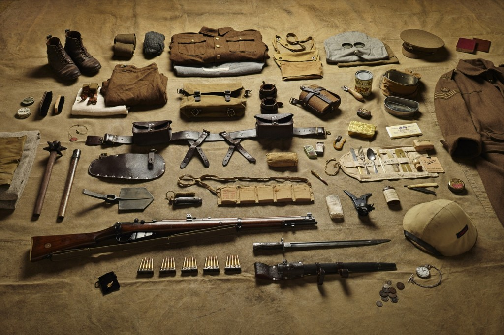

---
authors:
- first: Brandon M.
  last: Schechter
  role: author
date_reviewed: 2021-01-26
isbn: '9781501739804'
publication_year: 2019
publisher: Cornell University Press
rating: 4.0
reads:
- date_finished: 2021-01-26
  year: 2021
tags:
- academic
- history
- war
- ww2
title: 'The Stuff of Soldiers: A History of the Red Army in World War II Through Objects'
type: book
---

*The Stuff of Soldiers* is a material history of the Red Army, drawing heavily on first person accounts of equipment to give a sense of how ordinary soldiers viewed their participation in the Great Patriotic War, and the Soviet project of modernization.

*British Soldier's kit, 1916, from *[Thom Atkins's historical inventory photographs](https://www.thevintagenews.com/2016/12/07/evolution-military-kit-equipment-britains-soldiers-11th-century-today/)

Soviet cultural and standard military practices have many obvious analogs. Stakhanovite 'shock workers' were an industrial version of elite military heroism.  Most militaries are transformative command economies, taking the raw material of draftees, supplying them with the tools of the trade, and turning them workers on an assembly line of death.  And finally, soldiers are themselves interchangeable and replaceable parts. A unit in assault or defense is expected to take some proportion of casualties, a natural wearing down to be repaired in times of slack with new soldiers, while the intangible body of the unit continues forward.

*The Stuff of Soldiers* is an adapted dissertation, and a pretty good one given that it won the American Historical Association's Paul Birdsall Prize for best military history. The seven chapters move outwards, from the soldier's body itself, to uniforms, rations, shovels and entrenchments, offensive weapons, written paraphernalia, and war loot (the Russian *trofei*).  As a whole, the Red Army was one of the poorer forces due to the relative backwardness of the Soviet Union and the massive reversals of Operation Barbarossa. Rations were prepared in bulk by field kitchens, rather than being individually packaged units.  A simple sack substituted for complex web gear.  Even socks were dispensed with, in favor of peasant foot-wrappings.

This book is best when discussing what seems to be uniquely Soviet features of the Red Army.  Literary culture was public, letters to and from were read out loud. Along with official propaganda from on high, small units produced their own *listoviki*, exhortations of victory and revenge, with soldiers adding their own lines. The professionalizing Soviet army mimicked the Wehrmacht, re-introducing Tsarist-era shoulder boards to mark branch and Guards status, and wearing decorations for valor at all times.

As a military history and Soviet buff, this book has lots of great details, but little that's truly novel or surprising. And from a methodological perspective, synthesizing what soldiers wrote about their material objects is only a first pass. Machinery like [tanks](https://www.youtube.com/watch?v=N6xLMUifbxQ#t=1574s) (link to a fantastic comparison of Soviet and Nazi tank production) is more amenable to complex discussions of industrial policy, but even a coat or helmet is a complex manufactured item. Random internet nerds like [www.tankarchives.ca](https://www.tankarchives.ca/), or a guy in Colorado who goes by the handle Cessna, have more detailed things about the material objects of WW2. Cessna is positively livid on [the many failing of Nazi uniforms](https://forums.somethingawful.com/showthread.php?threadid=3950461&userid=0&perpage=40&pagenumber=1#post510517644) (SomethingAwful forums link. Pay the tenbux, noob), some of which are based on a brief time as a German WW2 reenactor--Cessna is a solid dude, and most of the people who reenact the Nazis are *very much not* the kinds of people he likes to spend time with.

This is a good book, but it's award winning history from an Actual Russian scholar, and some internet nerds I know of are doing comparable work as a hobby.