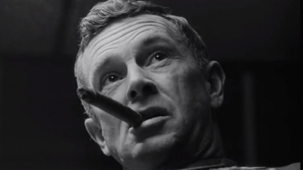

---
authors:
- first: David
  last: Deida
  role: author
cover: ./cover.jpg
date_reviewed: 2023-10-25
isbn: '9781591792574'
og_cover: ./og-cover.jpg
page_count: 202
publication_year: 2004
publisher: Sounds True
rating: 5.0
reads:
- year: 2023
tags:
- self-help
- psychology
title: 'The Way of the Superior Man: A Spiritual Guide to Mastering the Challenges
  of Women, Work, and Sexual Desire'
type: book
---

I can't tell if Deida is brilliant or insane or insanely brilliant. Masculinity in general is in crisis, and between you, me, and everybody on the internet, my personal masculinity isn't doing so hot. Deida identifies this issue as a blockage in the flow of masculine energy associated with the rise of the counterculture in the 1960s and feminism as a social movement. And the basic fix is to get right with your masculine essence.

*"I do not avoid women. But I do deny them my essence."*

In Deida's reading people of all genders have both masculine and feminine energies, which are available in various amounts. Men and women are of course legal, political, and social equals, but the private world of an intimate relationship, especially a physical heterosexual relationship, is only truly enacted in the interplay of energies between these two poles.

Assuming that you're a straight man (Deida notes he is writing mostly for straight men, though others can gain insights from this book), getting right with your masculine energy means getting clear about your purpose in life, finding strength in stillness, comfort with fear, and aligning and unblocking your natural impulses.

As this relates to women, to paraphrase, take women seriously but not literally. Feminine energy is about change, flow, and emotion. You can't capture it and hold it without killing it, but you can dive right in and *ravish* it, which is what women really want. They'll tempt you and distract you and place tests in your path, which you should read as indications of emotional insecurity rather than sincere desires. They don't want you to do what they ask, they want you to be strong enough to resist and impose your will on the situation.

So yeah, it's proto-Jorpian "Wimmenz are teh CHAOS DRAGON!" vibey stuff. But it's provocative, and what the hell, we're due for a vibe shift anyway.