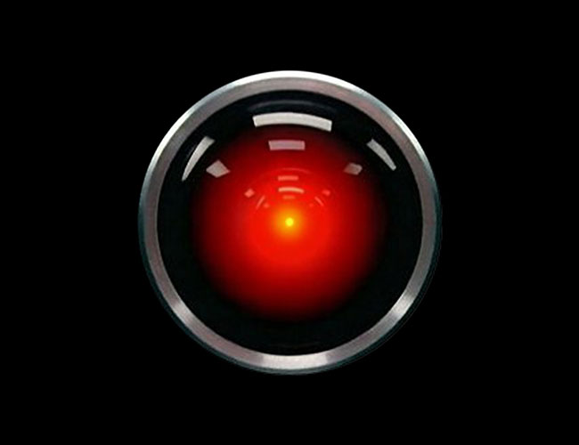

---
authors:
- first: William H. Rodgers
  last: Jr.
  role: author
cover: ./cover.jpg
date_reviewed: 2021-09-29
isbn: '9780812812268'
og_cover: ./og-cover.jpg
page_count: 320
publication_year: 1969
publisher: UNKNO
rating: 3.0
reads:
- date_finished: 2021-09-29
  year: 2021
tags:
- non-fiction
- biography
- history
title: 'Think: A Biography of the Watsons and IBM'
type: book
---

Before there was Bezos or Gates or even Silicon Valley, there was IBM. The Monolith of computing, one of the largest companies in the world, and one that exhibited decades of double digit growth.  And IBM was very much the creation of one man, Thomas Watson, who was succeeded by his sons Thomas Jr and Arthur Watson. It is a fascinating subject.

*The IBM HAL 9000 computer from 2001: A Space Odyssey*

*Think* is a odd little bit of business ephemera that suffers from being 50 years old, though any book which last half a century is a worthy classic, but more seriously from somewhat scattershot organizational approach.  

The first key point is that while IBM for most of the elder Watson's tenure was groping towards what we'd recognize as information technology, it was really a sales organization first and foremost.  Watson learned business in John Henry Patterson's Nation Cash Register company. Watson was assigned a special mission at Patterson's direction, "[A] heady, aggressive, and *palpably criminal* plan involving espionage, money, and the assignment of secret agents to clear the field and take possession of the secondhand [cash register] market across the country."  Most business biographies don't describe their subjects in such colorfully piratical terms.

After being fired from NCR, Watson moved to the sales division of the Computing-Tabulating-Recording Company, which was a conglomerate of companies producing time clocks, recording scales, and most important for the future, Herman Hollerith's line of punched-card sorting and tabulating machines. Watson reorganized the sales department, setting strict quotas, producing sales pitches, proselytizing an austere Protestant morality, and improving morale. He ascended to the presidency of the renamed IBM in 1924, and made himself the focus of the business.

There's an odd tension between Watson's personal moral stridency , which he imposed on the company in a mandated culture of dark suits and tee-totaling, and the cult-like atmosphere maintained by mass meetings with speeches and singing of the truly weird corporate anthem [Ever Onwards IBM](https://www.youtube.com/watch?v=L9oh3gqOEKU).  

For reasons, likely Watsons emphasis on sales skill and sincerity, but not adequately explained, IBM secured a commanding position.  The New Deal and WW2, with demands for vastly improved methods of statistically analysis, provided a massive boost to the company (Rodgers elides IBM's involvement in the Holocaust).  IBM was working on more efficient machines, with a big improvement being a mechanical gizmo that could multiply two numbers rather than doing repeated addition, and there was sideline in academic number crunching for astronomy and ballistic calculations.

IBM actually missed the early ball of computers, producing a mechanical monstrosity called the Mark I while GE made the vacuum tube based UNIVAC.  But as the elderly Watson Sr. stepped back and his sons assumed command, the company made several ambitious and effective bets, culminating in the IBM 360 mainframe (fun fact, the latest IBM z-model mainframes are still backwards compatible with software from a 1965 vintage IBM 360). Rodgers manages an astonishingly accurate prediction of the future of home computing, but this is a field where despite IBM setting a key standard with the IBM compatible personal computer, the company itself failed to maintain its massive position.

As a fan of historical computing, I enjoyed some of this book, but it's more about culture than tech, and as I mentioned, Rodgers doesn't seem to have the tools to write analytically about IBM's company culture and why it mattered so much.