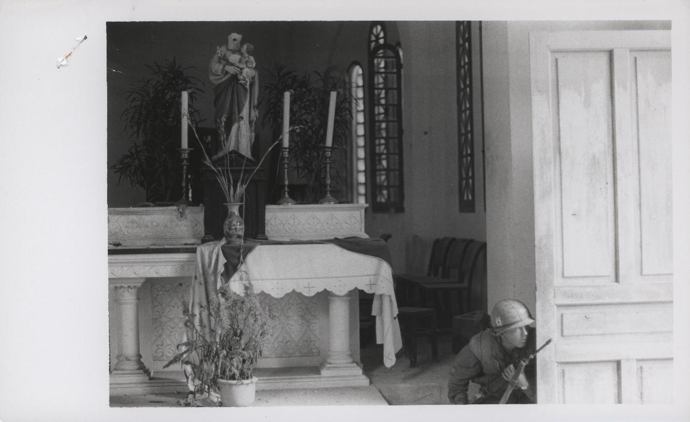

---
authors:
- first: Robert K.
  last: Brigham
  role: author
cover: ./cover.jpg
date_reviewed: '2026-05-31'
isbn: 978-0226846897
og_cover: ./og-cover.jpg
page_count: 260
publication_year: 2026
publisher: University of Chicago Press
rating: 4.0
reads:
- date_finished: '2026-05-30'
  date_started: '2026-05-27'
  year: 2026
tags:
- vietnam
- vietnam-war
- biography
title: 'This Is a True War Story: My Improbable History with Vietnam'
type: book
---
I'll preface this review by saying that I can't be entirely objective here, having taken Professor Brigham's excellent Vietnam War class back in 2009, which is at the root of the other 128+ Vietnam War books I've read. I also heard him deliver the talk version of the book at a 2025 conference to discuss the 50th anniversary of the fall of Saigon and the end of the war, which was incredibly moving.  So this memoir wanders around a lot, but falls into place incredibly well.

Bob grew up in Cambridge, New York, a small town near the Vermont border, knowing he was adopted and precisely nothing about his birth family or circumstances except his birthday. This was standard practice at the time, Bob was one of millions of the "baby scoop generation" adoptees, which transferred babies from single mothers to middle class families on the basis that this was better than the shame of being born out of wedlock. Papers were sealed to give all sides a fresh start, or at least that was the idea.

Of course, no one is a blank slate. Bob always wondered who his original parents were, reconstructing what the adoptee literature deems the Ghost Kingdom. An overheard phone call with a social worker when he was seven provided a single word: "Vietnam". The year was 1967, and Vietnam was beamed into American living rooms on a nightly basis. From this, Bob constructed an elaborate Ghost Kingdom. His father was in Vietnam, his mother had died shortly after he was born, and his biological father didn't know. But one day he'd be rescued and whole.

Bob's childhood was rough. His adoptive parents had adopted children to save their marriage, which worked about as well as you might expect, and got divorced around this time. Upstate New York was defined by crushing Rust Belt poverty. He had dyslexia, which was not accommodated. Everyone was trying their best, but his childhood was a lot of emotions best expressed by throwing a rock through a nearby window.

The Ghost Kingdom provided a lifeline. Bob scoured area cemeteries and New York state records for people who could have been his parents. He became obsessed with the Vietnam War, going to college and eventually earning a PhD in history and coauthoring a book with former Secretary of Defense Robert McNamara. A gifted teacher, he wound up at Vassar, where our paths crossed. His first step down this academic road was a research paper on a randomly selected photograph, of this photograph of an unknown Marine at the Battle of Hue. Bob established that the Marine was one of the first US troops to enter Hue during the Tet Offensive, and almost nothing else was known about him.*

*On the Lookout: A Marine of A Company, 1st Battalion, 1st Marines [A/1/1] crouches behind a church door checking for enemy near his position (official USMC photo by Sergeant Bruce A. Atwell).*

But his family of origin still haunted him. In 2000, while helping his mother move to Florida, he found his original unredacted birth certificate, which named his mother as Margaret Jamieson of Washington county, the same county he grew up in. This gave him enough to reach out to some Jamiesons, who told him his mother died of cancer in 1974, she was 23 when he was born, and very little else. The trail had run cold.

Only in the 2010s, with the advent of 23andme and similar DNA tests, did a second break come. Bob was related to the Atwells, a large and scattered family of 17 children. He started working through who could be his father (male, of age in 1960) and eventually the only possible candidate was Uncle Bruce, perhaps better known as Sergeant Bruce A. Atwell, USMC.

What!?

At this point the book delves into Bruce's life. He grew up in the foster care system, and wound up effectively abandoned by his mother. Once he aged out, he joined the Marines and thrived in this found family. He was trained as a photographer, was at Guantanamo Bay during the Cuban Missile crisis, served as an official photographer at the White House, and went to Vietnam in 1967, where his photos are widely regarded as masterworks capturing an intimate and artistic view of combat. Perhaps too intimate, as he accompanied Alpha 1/1 into Hue and was severely wounded while taking photos. He was honorably discharged, became a railway engineer, married and had a family. He died in 2006 of heart disease.

As for Bob, Margaret and Bruce had lived at adjacent farms in 1959. Despite the age difference (Bruce was 14, Margaret 22), they had a relationship. She likely concealed the pregnancy from him, and when the foster care system rotated Bruce to a different location, they lost touch. 

As the subtitle says, this is an improbable and incredible story. Bob turned out all right. His adoptive parents Marge and Al loved him and did their best. He had an adopted sister, Jane, who died tragically young of a rare cancer. He's made his own family, and a successful career. He located his birth family, though too late to know his biological parents. But there's a wound in his soul, and he has a lot to say about the basic crime of sealed adoption records and the many failures of the foster care system. As a Vietnam War historian, I enjoyed the section on Bruce Atwell and combat photographers, though as an academic I wish there was more about writing *Argument Without End*. 

I really can't make an assessment of this book on the merits, but the story is evidence that sometimes fate works out.

*according to a Flickr comment by huevet68@aol.com, the Marine in the photo is Larry Lewis of 1st Platoon, Alpha 1/1. Sometimes the internet makes research easy.
