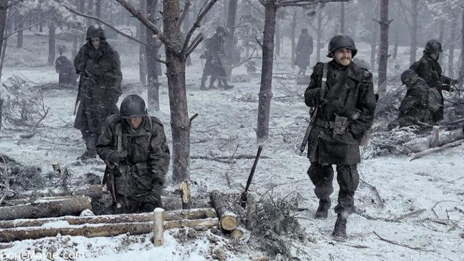

---
authors:
- first: Peter
  last: Schrijvers
  role: author
date_reviewed: 2024-02-19
isbn: '9780300179026'
page_count: 328
publication_year: 2014
publisher: Yale University Press
rating: 4.0
reads:
- year: 2024
- year: 2024
tags:
- ww2
- war
- history
- academic
title: 'Those Who Hold Bastogne: The True Story of the Soldiers and Civilians Who
  Fought in the Biggest Battle of the Bulge'
type: book
---

*Those Who Hold Bastogne* is fine military history that will satisfy both war buffs and serious historians, without pushing forward the edges of scholarship in a substantial way. This is no fault of the author, The Battle the Bulge is one of the more covered events in a very thoroughly covered war. Schrijvers has ably covered a massive battle with hundreds of thousands of participants.

*Bastogne, from the *Band of Brothers* series*

The basic story is pretty clear. In December 1944, Hitler launched a desperate last gasp offensive to split the British and Americans and secure a truce in the west.  Mighty panzer armies once again smashed through the Ardennes, overrunning weak Allied divisions assigned to what was predicted to be a quiet sector.  The only available reinforcements, the 101st Airborne Division, were rushed to the key Belgian crossroads town of Bastogne, where they held off the Nazis until relived by Patton's 3rd Army.

And that is the story, pretty much. Schrijvers is careful to note that while the airborne gets much of the glory, plenty of other units contributed to the fighting, and suffered heavily casualties as well, including a unit of African-American gunners. Neither side had superiority and the battle turned into a months long attritional grind that saw Allied logistics and firepower ultimately triumph. Schrijvers interleaves the movement of divisions with on-the-ground stories of individual soldiers culled from medal citations and oral history projects, skillfully blending the macro and the micro.

Two moments stand out. First, Belgian civilians, especially around Bastogne, suffered terribly from indiscriminate firepower, much of which was deployed by the Allies. P-47 fighter bombers burnt out Nazi fighting positions and Belgian cellar shelters alike with Napalm. Families were gunned down by trigger-happy machinegunners firing at dark shapes against the snow. War is tragedy.

Second, we all know General McAuliffe's famous reply of "NUTS" to the German offer of surrender. What I did not know is that the general was asleep when the offer came in, catching a moment of rest after several days of constant action, and "nuts" was a mumble on awakening, that his staff decided was the best response to the offer.