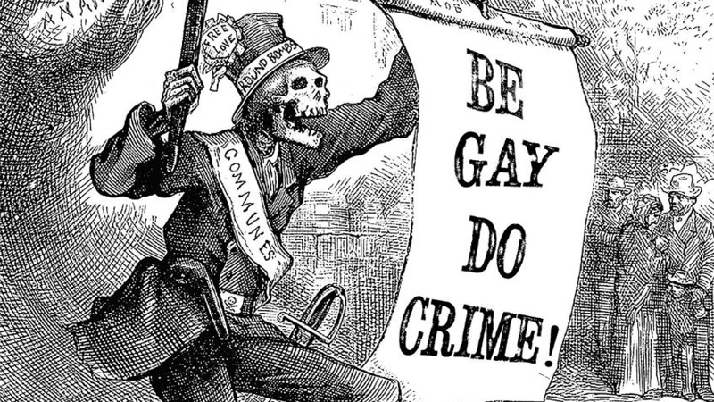

---
authors:
- first: Melissa
  last: Scott
  role: author
cover: ./cover.jpg
date_reviewed: 2023-04-17
isbn: '9780812522136'
og_cover: ./og-cover.jpg
page_count: 379
publication_year: 1995
publisher: Tor Science Fiction
rating: 4.0
reads:
- year: 2023
tags: []
title: Trouble and Her Friends
type: book
---

*Trouble and Her Friends* might be the last cyberpunk novel (at least according to Matthew Claxton), written in the final days when the internet was still the net, and not the world wide web, or worse a walled garden of apps and platforms.  Trouble and Cerise are partners, romantic and criminal, two of the baddest hackers on the net, when Trouble disappears after a new anti-hacker law passes. Cerise goes legit and tries to forget her old partner, but three years later someone appears on the net using Trouble's handle and some of her programs. Cerise's company and the US Treasury want Trouble in custody, and the two of them reunite to find and take down the punk threatening Trouble's quiet retirement.

There is a lot that is good in this book, mostly tied up in this quote. “Maybe that was why it was almost always the underclasses, the women, the people of color, the gay people, the ones who were already stigmatized as being vulnerable, available, trapped by the body, who took the risk of the wire.” The cyberspace has a nice Gibsonian vibe, Trouble and her cadre of queer hacker friends are wonderfully drawn. This book is definitely about being gay and has some ambitions about doing crime. There are fantastic asides, like districts haunted by vicious dolly-gangs of wannabe corporate secretaries with network implants, stiletto heels, and switchblade knives.

*Good advice from mr skelly*

Unfortunately, it also has some serious flaws. The pacing is on the languid side, with important plot threads like Cerise's boss's obsession with Trouble dropped aside. The conclusion centers around the real and virtual twin towns of Sea Haven, a gray zone useful to the shadows and bright lights of the net alike, abandoning the idea that what happens in cyberspace is about cyberspace for a physical confrontation. And while I was really hoping for a solid landing, the end is about outsiders coming inside, about crackers growing up into cops, rather than breaking down unjust systems of exploitation.