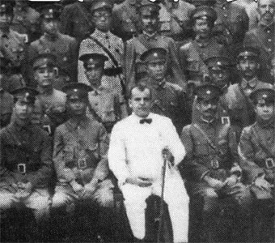

---
authors:
- first: Daniel S.
  last: Levy
  role: author
cover: ./cover.jpg
date_reviewed: 2018-08-06
isbn: '9780312156817'
og_cover: ./og-cover.jpg
publication_year: 1997
publisher: Thomas Dunne Books / St. Martin's Press
rating: 4.0
reads:
- date_finished: 2018-08-06
  year: 2018
tags:
- biography
- history
- jewish
title: 'Two-Gun Cohen: A Biography'
type: book
---

*Record Scratch, Freeze Frame*

"Yep, that's me. Now you might be asking, how does a Yid from the East End wind up in Guangzhou, next to President Chiang Kai-shek and the rest of the KMT honchos?"

Morris "Two-Gun" Cohen is one of those peripheral figures of history. Almost forgotten today (I heard about him through a *War is Boring* article), Levy's biography is a fascinating tale of a true character.  The first difficulty, as Levy recounts, is that almost nothing written about Cohen, including his 1954 autobiography, is accurate. A scoundrel to the bone, Cohen puffed up his importance.  With that stripped away, what's left is a man who rose from almost nothing, who made a few daring friendships and seized chances at the right time, and who lived life on his own terms.

Morris was born in 1887 in Radzanów, Poland. His family escaped the Tsarist pogroms and moved to London around the turn of the century, landing in the bustling Jewish neighborhood on the East End.  Morris was a natural trouble maker, and after an arrest for pickpocketing at the age of 13, was sent to the Hayes Industrial School, where he excelled, and then to Canada at the age of 16. He lasted a year as a farmer before skipping out to join the circus, finally settling into a comfortable life on the grift: Small short cons to get ready cash, late nights gambling, and even some respectable success as a real estate salesman in Edmonton. He was in and out of jail for various crimes, but generally getting up to as much trouble as a man could get up to in Canada at the time.

Vice in Canada around 1910 was concentrated in and around the Chinatowns, and Chinese-Canadians were subject to vicious racism.  Cohen intervened in a robbery against a Chinese friend, Mah Sam, and the trajectory of his life bent towards adventure.  Cohen became a sworn brother of the Tongmenghui, the underground revolutionary society of Sun Yat-sen, first President of China.  After a stint in the Army during WW1, where Cohen built railways under fire, he finally made his way to China, met Sun Yat-sen, and became his bodyguard and aide de camp.

China in the Warlord Era was a place where a bold man could make a fortune.  Reports that Cohen was the power behind any number of warlords are almost entirely false, rumors spread to increase his own importance, including the rank of "General", to which he was eventually officially promoted, though he was never a warlord in his own right.  Cohen did become a moderately successful gunrunner, switching his nickname to "Five Percent", for his regular commission.  He spent money as fast as he made it, living high in Guangzhou, Shanghai, and Hong Kong.  He was in Hong Kong in 1941 when it fell, and spent years in a Japanese POW camp before being exchanged. He was in San Francisco for the birth of the UN, and may have played a role in getting the Chinese delegation to vote in favor of Jews living in the British Mandate of Palestine. 

Post-war was a darker time for Cohen. He got married, but wound up divorced because he spent months in China, trying to put together deals that went nowhere, and was otherwise a lousy and emotionally abusive husband.  Being a family patriarch and pillar of the Manchester Jewish community were thin gruel compared to the action and money of his youth.  He was one of those old men who loiter in hotel lobbies, smoking cigars and waiting for someone to tell his well-worn jokes and stories to.  The later chapters of the biography are full of assessments from various foreign service officers describing Cohen as an unreliable windbag.

Cohen got a break in the 1960s, finally acting as an intermediary between Rolls Royce and Communist China on an airplane deal.  Once an ally of Chiang Kai-shek, Cohen switched his loyalties to the Communists as the rightful heirs of Sun Yat-sen's vision for modern China.  Both sides benefited. Communist China got a useful Westerner to speak on their behalf, Cohen got to feel important again.  He spent his last years speaking in favor of the Great Leap Forward and Cultural Revolution, before dying in the presence of his family in England in 1970.  His life straddled an era, and if he never was one of the Great Men of history, he met history on his own terms.  Levy has done us a service in giving an honest account of his life.

Oh yeah, and the "Two-Gun" moniker.  Cohen was in a gunfight in China when he got winged in the left arm. In his own words: “The bullet that caught me in the left arm had made me think. Supposing it had been my right arm and I carried my gun that side, I’d not have been able to use it. As soon as we got back to Canton I got me a second gun, another Smith and Wesson revolver, and I packed it handy to my left hand. I practiced drawing and soon found that I was pretty well ambidextrous—one gun came out about as quick as the other.”