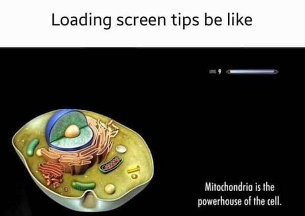

---
authors:
- first: Dennis
  last: Bray
  role: author
cover: ./cover.jpg
date_reviewed: 2023-10-02
isbn: '9780300141733'
og_cover: ./og-cover.jpg
page_count: 280
publication_year: 2009
publisher: Yale University Press
rating: 4.0
reads:
- date_finished: 2023-10-02
  year: 2023
tags:
- science
- non-fiction
title: 'Wetware: A Computer in Every Living Cell'
type: book
---

I will be decrepit and on my deathbed with almost everything lost, the faces of my family, my favorite songs, but one thing will remain.

*Mitochondria are the powerhouse of the cell.*

Wetware is a popular introduction to microbiology, framed by Bray's contention that even the simplest cell is an information processing system. And as even basic observation shows, this must be true. *E. coli* moves towards nutrients and away from poisons. Amoebas are microscale apex predators, stretching towards lesser protozoans with pseudopods. And higher organisms are delicately orchestrated complexes of organs and tissues, grown from a single zygote that contains every necessary instruction encoded in the four base pairs of DNA.

Information processing is the central metaphor of our era, much as clockwork was that of Newton's. However, as a popular book, *Wetware* is often frustratingly vague about the details. Methylation turns proteins and genes on and off. The addition or removal of phosphorus groups from proteins provides necessary energy to combat entropy and also serves to time processes. But information as we use it is all symbolic processing, which as the Church-Turing thesis argues is the same thing, no matter the hardware. Binary digital logic is just the easiest to engineer. Wetware processing is something profoundly different, an analog process of protein interaction occurring at the speed of molecular diffusion. A physics simulation of a single cell would be a massive computational endeavor, yet it's unclear if a statistical abstraction would preserve whatever vital processes make the whole thing work.

Fascinating, especially for someone who last took a bio course in 9th grade, but I wanted something deeper and bolder.