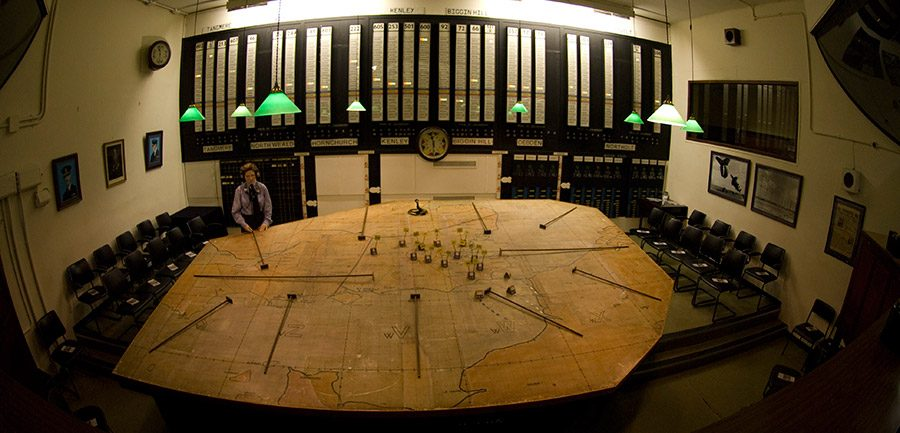

---
authors:
- first: Michael
  last: Korda
  role: author
cover: ./cover.jpg
date_reviewed: 2019-07-24
isbn: '9780061125355'
og_cover: ./og-cover.jpg
page_count: 336
publication_year: 2009
publisher: Harper
rating: 5.0
reads:
- year: 2019
tags:
- history
- war
- ww2
title: 'With Wings Like Eagles: A History of the Battle of Britain'
type: book
---

There is a great romanticism to the Battle of Britain. In the summer of 1940, at the height of Nazi power, all that stood between England and invasion were the pilots of RAF Fighter Command. Contrails traced labyrinths in the blue summer sky miles above the Earth as Spitfire and Messerschmidt tangled. The war fell from the sky on picnickers; shell casings, flaming wreckage, men, bombs.  And of course, the good guys won. "This was their finest hour." Roll credits.

The real story is more complicated, of course, and Korda centers the battle as a conflict between Air Marshall Hugh Dowding of the RAF, and Herman Goering for the Luftwaffe. Dowding is cast as a visionary.  In the 1930s, when prevailing wisdom was that 'the bomber would always get through', Dowding pushed for the creation of the world's first integrated air defense network, a combination of radar, spotters, hardened telephone lines, centralized dispatch rooms where maps and indicator lights which enabled command of an air battle in real time, and fast and powerful monoplane fighters to do the killing.  This was not going to be a random brawl, but a carefully planned battle of attrition.  In the 21st century, with NASA Mission Control, the Star Trek bridge, and network-centric warfare, this is common stuff, but Dowding invented it all.

*The Churchill Bunker, with the big board*

Against this, Goering's Luftwaffe was the most powerful airforce in the world at the time. But the Bf-109 had the range to stay over England for mere minutes, the medium bombers lacked accuracy and destructive power, and the Stuka and Me-110 were sitting ducks for modern fighters. The Nazis were also hampered by terrible intelligence, that continually predicted the RAF was at the breaking point, and political problems, when a retaliatory strike on Berlin led to bombers being pulled off of airfields and factories to punish Berlin.

In one sense, the outcome was never in doubt. Dowding just had to contest control of the air through the first week of October, after which storms would make Operation Sea Lion impossible.  On the other hand, RAF fighter command sacrificed immensely, taking tremendous casualties in the process of bleeding the Luftwaffe white. Dowding himself was never a political player, and had to turn over his command in November 1940. But Britain had been saved. As Churchill put it, "Never in the history of mankind has so much been owed by so many to so few."

*With Wings Like Eagles* is an erudite popular history that rises above the pack through a novel, and well-founded thesis around the command of Air Marshall Dowding.