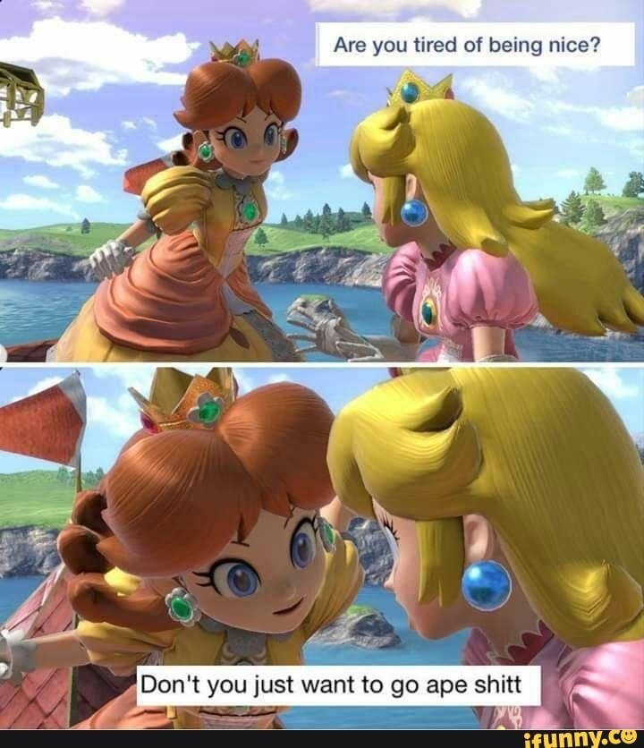

---
authors:
- first: Ben
  last: Nielson
  role: author
- first: ''
  last: Victor Costa
  role: author
date_reviewed: 2021-02-05
publication_year: 2020
publisher: Bandit Camp
rating: 5.0
reads:
- year: 2021
tags:
- fantasy
- rpg
title: Wicked Ones
type: rpg
---

How many years have we been adventurers? Delving into darkness, slaying found fiends and retrieving treasure to increase our heroic power.  Sure, sometimes we might be more mercenary murderhobos than actual heroes, but roleplaying games are about adventure.  Well, not any more!

*Wicked Ones* is a Forged in the Dark game about being the monsters. You are creatures of unusual ambition and intelligence, ruling over a dungeon populated by lesser minions and imps.  You argue, scheme, develop dark plans, and venture out onto the surface to raid and corrupt the forces of Light that are prevent you from fulfilling your monstrous destiny.  As your dungeon grows, you attract adventurers who murder their way towards your sanctum. But if you survive, you'll topple the whole region into chaos, claiming it for the forces of darkness.

*Wicked Ones* gets a lot of points for the reverse dungeon concept, but it's also a really nicely tuned version of the FitD system. Monsters are resilient, so they clear stress and harm automatically.  There's a new level of consequence, Shocked, which imposes a penalty to the next roll using the relevant ability.  Downtime and the loot cycle have also been reworked to be more monstrous, and you can bank Dark Hearts to get bonus dice by playing into moments when your monstrous appetites harm you.  Resistance rolls have been reworked into a static cost.  In general, having read a fair number of FitD games, *Wicked Ones* is one of the better implementations of the system, a clear and stripped down FitD 1.5!

The book comes with plenty of material, with three schools of magic, alchemy, and goblincore mad science to flavor the usual abilities. There are four sample regions to corrupt, lots of tables of weird items and spells, four advanced monsters with powerful abilities, and plenty of incredibly stylish artwork. The tone is horror-slapstick.  You're encouraged to commit atrocities, but fiction and your base appetites will implode your plans in a funny way.

There aren't many games in this vein, and *Wicked Ones* is a cut above.  My only problem is that it came out after my *Monstrous Revolution* campaign was in full swing.  Maybe next time!