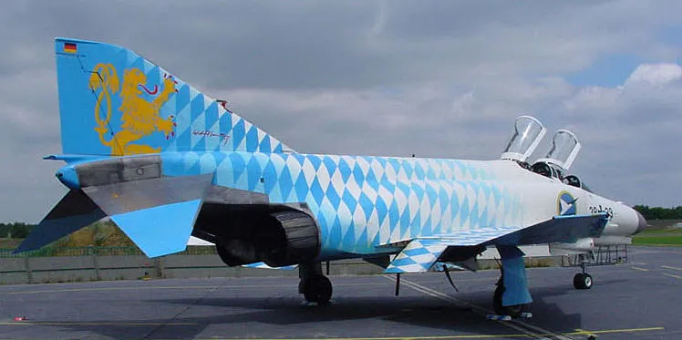

I read 150 books in 2018, a tie in Bookrace 2018 with Professor John Carter McKnight. And it was quite a year in books!

*Very Bavarian F-4 Phantom*

## Best History
[*The Making of the Atomic Bomb*](/book/the-making-of-the-atomic-bomb-25th-anniversary-edition-rhodes), Richard Rhodes. You can draw a line in history right through July 16, 1945. There, in the New Mexico desert, a team of brilliant physicists followed up the most productive decades in science with a frightening demonstration of the mastery of man over nature. Rhodes perfectly captures the exciting life of physics at the dawn of the sub-atomic age, and the massive, continental-scale engineering to create enough U-235 and plutonium to build the bomb, and wipe cities off the face of the earth in a single blow.

## Best Science Fiction
[*Seven Surrenders*](/book/seven-surrenders-palmer), Ada Palmer. Scifi is always my favorite genre, and in her densely layered Terra Ignota series, Palmer has taken up the mantle of Ursula K. LeGuin, carefully dissecting a wonderfully alien ambiguously heterotopic 45s  possible future, and asking if we would be willing to kill a world to build a better one. The first book, *Too Like the Lightning*, was good. The second book was better, a rarity as promising series have let me down (cough *The Fifth Season* cough). I'm excited to see how she finishes the series. And by the way, I wrote a piece on the [20th anniversary of my favorite science fiction novel of all time](/posts/happy-20th-birthday-to-distraction), Bruce Sterling's *Distraction*, with a [companion interview](/posts/distraction-at-20-an-interview-with-bruce-sterling) with Bruce himself.

## Best Fantasy
[*City of Stairs*](/book/city-of-stairs-bennett), by Robert Jackson Bennett, and it's not even close. Fantasy as a genre is defined by its relationship to an imaginary history, think of Tolkien and his many ages and lost kings and hidden legacies. Bennett has a conversation with this convention, imagining a world where former slaves killed the gods, and a historian-spy protagonist whose job is erasing the past to protect the new order. Imaginative, stylish, and masterfully crafted, Bennett shows that there is life in the genre.

## Best Non-Fiction
[*Bad Blood: Secrets and Lies in a Silicon Valley Startup*](/book/bad-blood-secrets-and-lies-in-a-silicon-valley-startup-carreyrou) by John Carreyrou. *The Soul of a New Machine* as a Coen Brothers' style dark farce, *Bad Blood* is the story of the meteoric rise and faster descent of Theranos, a medical diagnosis company that charmed investors while utterly failing to make a product. In the end, a fact is that which resists arbitrary thinking, and no amount of design visioning could make their analyzers work.

## Best Military History
[*LikeWar: The Weaponization of Social Media*](/book/likewar-the-weaponization-of-social-media-singer-emerson-t-brooking) by P.W. Singer and Emerson T. Brooking. We're still trying to make sense of what happened in 2016, when toxic memes seemed to take over democracy. *LikeWar* is the first accessible strategic overview of information warfare, and the black-hole like intellectual warping of social media. Whatever happened is like armored warfare circa 1918. Get ready for the blitzkrieg.

## Book of the Year
[*Among the Thugs*](/book/among-the-thugs-vintage-departures-buford) by Bill Buford. An ethnography of British football culture and the psychology of crowds, *Among the Thugs* is an eminently quotable masterpiece of applied anthropology that prefigures the nihilism of 2018 masculinity by decades. Buford observes that in England, it is just not done for members of the literati to talk about the working class, and so no one will admit that the true "English working class" has vanished. I quote in full.

> "It is still possible, I suppose, to belong to a phrase—the working class—a piece of language that serves to reinforce certain social customs and a way of talking and that obscures the fact that the only thing hiding behind it is a highly mannered suburban society stripped of culture and sophistication and living only for its affectations: a bloated code of maleness, an exaggerated, embarrassing patriotism, a violent nationalism, an array of bankrupt antisocial habits. This bored, empty, decadent generation consists of nothing more than what it appears to be. It is a lad culture without mystery, so deadened that it uses violence to wake itself up. It pricks itself so that it has feeling, burns its flesh so that it has smell."

You want to understand what's happening, read *Among the Thugs*.
