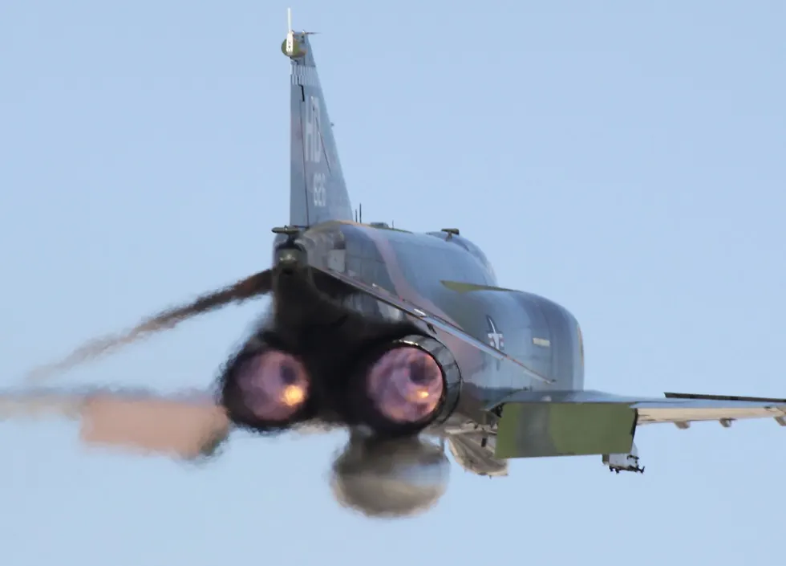

I read 127 books in 2019, down from last year and my all time high of 200 books in 2017, but still quite respectable considering it's been a busy year. This year was heavier on history and non-fiction books, and somewhat sadly, I didn't read any new fiction with the 'you gotta read this' quality of *City of Stairs* or *Seven Surrenders,* though I did return to some beloved classics like Dune, where I reread all six books (stop with *God Emperor*) and *The Hitchhiker's Guide to the Galaxy.* So let's talk about some books!

*USAF F-4*

## Best History
[*The Perfectionists: How Precision Engineers Created the Modern World*](/book/the-perfectionists-how-precision-engineers-created-the-modern-world-winchester) by Simon Winchester. We think about the industrial revolution in terms of horsepower and steam, but the real revolution was in precision, in measuring and making parts so that they fit together with a minimum of losses and friction, and fit every time, allowing replaceable parts and assembly lines. Winchester has an undeniable enthusiasm, jumping through the history of technology and orders of magnitude improvements in precision from steam cylinders to silicon chips.

## Best Science Fiction
[*A Memory Called Empire*](/book/a-memory-called-empire-martine) by Arkady Martine. A young and untested ambassador to an interstellar empire has to navigate deadly political waters and the rapids of her relationship with her xenophile imperial guide, while dealing with a sabotaged memory of her predecessor. Martine is a talent to watch.

## Best Fantasy
[*The Library at Mount Char*](/book/the-library-at-mount-char-hawkins) by Scott Hawkins takes the 'secret war of wizards' subgenre to new heights, with characters with godlike powers and matching traumas engaged in a subtle contest to remake reality. Nothing else I've read plays up the sheer weirdness and horror of magic as well as this book.

## Best Non-Fiction
[*From Counterculture to Cyberculture: Stewart Brand, the Whole Earth Network, and the Rise of Digital Utopianism*](/book/from-counterculture-to-cyberculture-stewart-brand-the-whole-earth-network-and-the-rise-of-digital-utopianism-turner) by Fred Turner. If there's an iconic figure of the 21st century, it's the technological entrepreneur. You know the type, the savvy, cool, cutting-edge, networked, leveraged, foresighted thought leader. The kind of person who makes a lot of money not by doing better than the competition, but by blazing whole new economic sectors. That figure is a kind of mediated chimera in the mold of the Original, the central subject of this book, one Stewart Brand. Turner's book chronicles Brand's life and work at the cutting edge, and how his *avant-garde* technocommunalism built a vision of the future that succeeded all the more for failing every single one of its utopian promises.

## Best Role-Playing Game
[*Comrades: A Revolutionary RPG*](/rpg/comrades-a-revolutionary-rpg-akers) by W.M. Akers. This was actually quite a year for gaming. I'm currently running LANCER and Scum & Villainy, which are great systems, and playing D&D5e, which is adequate. But Comrades is *inspired*, a powered-by-the-Apocalypse game about making your own revolutionary cell and taking down Those Bastards. *Comrades* made PbtA click for me, and the moves, including Start Something to incite a crowd to action (leading the people in song is a valid revolutionary act) and the session-ending revolutionary path moves, are some inspired game design.

## Best Military History
[*With Wings Like Eagles: A History of the Battle of Britain*](/book/with-wings-like-eagles-a-history-of-the-battle-of-britain-korda) by Michael Korda. If there ever was a 'good war', it was the Battle of Britain, "their finest hour" in Churchill's soaring rhetoric, when a few hundred RAF and allied pilots stood between Hitler's war machine and England as the last bastion of liberty. Korda's book covers the glory and romance, of course, but goes deeper, to explore how Air Marshall Dowding and the boffins built the first integrated air defense network, using radar, telephones, aerial radio, and central war rooms to control the battle of attrition that blunted the Luftwaffe, and led Hitler towards the invasion of Russia and his eventual defeat.

## Book of the Year
[*Six Frigates: The Epic History of the Founding of the U. S. Navy*](/book/six-frigates-the-epic-history-of-the-founding-of-the-u-s-navy-toll) by Ian W. Toll. *Six Frigates* is a masterpiece, a history which makes the politics and people of the early American republic come alive, and demonstrates why these ships, and the surviving *USS Constitution*, still matter. The Navy is specified in the Constitution, but the Jeffersonian wing of American politics saw it as creeping monarchism, a way for bankers and merchants to use public funds to their own benefit, and for liberty to get entangled in the old feuds of Europe. The six founding frigates were the original defense pork-barrel, and their officers a boondoggle of petty rivalries, amateurism, and duels. Yet these ships went on to beat the Barbary corsairs, and in the War of 1812 puncture the 'invincible' British Royal Navy, establishing a tradition of victory and honor for the young republic.
