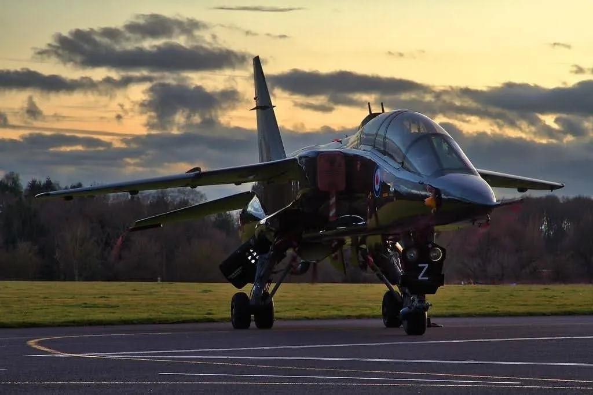

I had a kid January 1st, so putting together my annual best of list has been rather delayed. 2020 was a horrific year. The pandemic, police riots, the election, and just a general existential nightmare. Despite everything, I managed to increase my books read to 128, though it's probably not going to get that high again for years. Here's what I thought was the best of the best.

*Jaguar at dawn*

## Best History
[*Cadillac Desert: The American West and Its Disappearing Water*](/book/cadillac-desert-the-american-west-and-its-disappearing-water-reisner) by Marc Reisner. In the west, water doesn't flow downhill. Water flows towards money. Past the rainfall line on the great plains, annual precipitation drops to less than 20 inches, and agriculture only works with the aid of expensive irrigation. To make western settlement possible, the US Bureau of Reclamation embarked on a massive project of dam building, megascale hydrological engineering that is immensely expensive, ecologically devastating, and locks in a politically connected group of large farmers and real estate developers whose existence distorts sensible land and environmental policy. Reisner is a Jeremiah, crying out against the apocalypse, and while his doomsday hasn't yet arrived, it also hasn't been averted. *Cadillac Desert* is key reading for anybody who lives west of the Rockies.

## Best Science Fiction
[*The Space Between Worlds*](/book/the-space-between-worlds-johnson) by Micaiah Johnson is a desperate confession. Cara is a traverser, a researcher who moves between dimensions for her corporate masters. One of the limits of the tech is that it will kill you if you're alive in the other place, so the best traversers are people who are dead almost everywhere else, hardscrabble refugees and slum dwellers. Cara lives in a glossy city-arcology, but she's from the blights of Ashtown, and she's dead almost everywhere else. Her journey is a revelation of secrets, crimes, and evils committed in the name of power and control across the multiverse. It's polished, thoughtful, emotional, and a cry of rage against our current unjust world.

## Best Fantasy
[*The Empress of Salt and Fortune*](/book/the-empress-of-salt-and-fortune-vo) by Nghi Vo. If jazz is the notes you *don't* play, *Empress* is a perfect puzzle box of a jazz novella. A cleric-historian visits a lake-side villa that has recently been removed from behind a sorcerous veil and finds an elderly woman named Rabbit, once handmaiden to the empress. In a series of memories, prompted by items in the villa, Rabbit tells a tale of love and revolution, and of women connecting across barriers. It's a gem.

## Best Non-Fiction
[*I Want to Believe: Posadism, UFOs and Apocalypse Communism*](/book/i-want-to-believe-posadism-ufos-and-apocalypse-communism-gittlitz) by A.M. Gittlitz. In the immense spectrum of leftist politics, Posadism is the punchline, a Trotskyite UFO cult advocating global thermonuclear war to advance the rights of workers. Gittlitz has written the biography of Homero Cristalli, the Argentinian agitator who adopted the revolutionary *nom de guerre* J. Posadas, but this is about more than one supremely confused man. As capitalism reaches new heights of inequality and brutality, as politics become ever more spectacle, and as even incremental change is deemed impossible, why not demand the Fully Automated Luxury Space Communism? While I can't endorse cults of personality or nuclear war, anti-realism is a major political force, and the Left can't abandon it to right-wing grifters.

## Best Role-Playing Game
[*Flying Circus*](/rpg/flying-circus-the-high-flying-adventure-game-chappell) by Erika Chappell is a game about being a dashing flying ace and queer kid in a fantastic interwar Europe inspired by the soft apocalypse aesthetic of Studio Ghibli films. It's a labor of love, with almost everything, including scores of incredible drawings, done by author and designer Erika Chappell. The system is a heavily modified Powered by the Apocalypse, where your pilots are part of a mercenary band navigating their own growing emotions amidst the legacy of a horrific war. Despite being rules-light PbtA, Chappell manages a crunchy Boyd-inspired energy-maneuverability system for dogfighting.

## Best Military History
[*Most Secret War*](/book/most-secret-war-jones) by R. V. Jones. In the late 1930s, R.V. Jones was a middling British physicist with a mediocre project in infrared aircraft detection that simply wasn't possible yet. The coming war catapulted him to a key role in the field he developed called scientific intelligence. With the tricky soul of an inveterate practical joker, Jones coordinated the first electronic warfare campaign against Nazi radio navigation aids to confuse night-bombing, and then offered a counter-offensive in the Battle of the Beams to let the RAF strike back. He finished the war working against the V-1 and V-2. Jones is an engaging raconteur, and it's lots of fun and some good lessons as he describes his ploys against the Nazis and his real enemies in the stuffed shirt British academy.

## Book of the Year
[*The Anarchy: The East India Company, Corporate Violence, and the Pillage of an Empire*](/book/the-anarchy-the-east-india-company-corporate-violence-and-the-pillage-of-an-empire-dalrymple) by William Dalrymple. I have a good education, but it covered India in only the most cursory way. Dalrymple is an Englishman, but one with an immense love for India, and in this book he describes the horrific encounter between a complex and glorious civilization and a bunch of sheep-molesting barbarians from an impoverished island. Over 40 years, the British East India Company developed one of the largest armies in the world (at roughly the same time as the Napoleonic Wars, and as powerful as any of the grand armies rampaging across Europe) and used it to decisively crush a series of Indian princes and emperors as a prelude to systematic looting. It's a triumph of finance over culture, as well-paid EIC forces routed royal levies. While the Indians could win battles, England had a limitless supply of grasping adventurers looking to make their fortune and won the war.

## Bonus Series
Ian Toll's Pacific War trilogy, [*Pacific Crucible*](/book/pacific-crucible-war-at-sea-in-the-pacific-19411942-toll), [*The Conquering Tide*](/book/the-conquering-tide-war-in-the-pacific-islands-19421944-the-pacific-war-trilogy-2-toll), and [*Twilight of the Gods*](/book/twilight-of-the-gods-war-in-the-western-pacific-1944-1945-toll). It's cheating to nominate three books, but with this series Toll has joined the ranks of great military historians. The centerpiece of this series is the grand campaign between the Imperial Japanese Navy and the American Pacific Fleet, which Toll covers from the perspective of the capitols, the great admirals like Nimitz, Mitscher, and Yamamoto, down to the ordinary men fighting and dying in destroyer engine rooms and on remote islands. While there are better books on individual actions, no one covers the sweep of the war like Toll.
