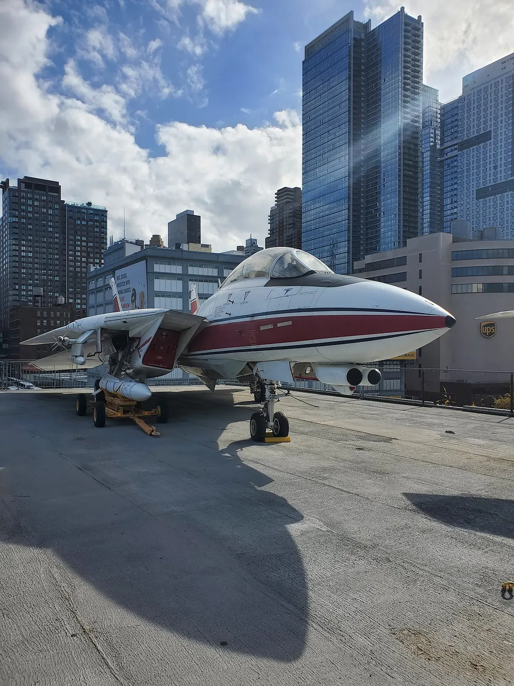

This past year I managed 101 books, which is my lowest total since I started tracking my books, but I’m just happy to hit 100 given everything going on. This has definitely been a year of Finding Out, and that finding out included some pretty good books.

*F-14 Tomcat on the USS Intrepid. Photo by me*

## Book of the Year
[*Our Shared Storm: A Novel of Five Climate Futures*](/book/our-shared-storm-a-novel-of-five-climate-futures-hudson) by Andrew Dana Hudson is a triple threat. First, it’s a science-fiction novel so compelling that I stayed up until 4:00 AM to finish it. Second, it is a work of serious scholarship grounded in the best available research on climate change and Hudson’s own ethnographic study at a UN COP climate conference. And third, it’s a methodological advance in narrative foresight. the novel tells one basic plot five ways with a constant cast. It is 2054 and COP60 in Buenos Aires, which is hit by an unexpected storm coming up the Río de la Plata. Despite the common premise, this is very much not the same story five time over. Each chapter focuses on a new character, each world is unique, the issues at COP60 distinct, and the characters shaped by different lives. Our Shared Storm shows what science fiction can do by making the big story of the 21st century concrete, and yet still within our power to choose better paths.

## Best History
[*Digital Apollo: Human and Machine in Spaceflight*](/book/digital-apollo-human-and-machine-in-spaceflight-mindell) by David A. Mindell is a masterful study of the Apollo Guidance Computer, and the new forms of organization and synthesis which were birthed in the space program. The AGC mediated between rocket designers who preferred total automation, and test pilot astronauts, who wanted to hand fly as much as possible. The synthesis was a success: Period automation could not distinguish a safe landing zone from a boulder field, while the lunar lander was essentially uncontrollable with computer assistance. The AGC represented a new kind of computer: real-time, interactive, and robustly recovering from failures. The kind of computer you’re reading this on.

## Best Military History
[*A Game of Birds and Wolves: The Ingenious Young Women Whose Secret Board Game Helped Win World War 
II*](/book/a-game-of-birds-and-wolves-the-ingenious-young-women-whose-secret-board-game-helped-win-world-war-ii-parkin) by Simon Parkin is a study of the critical Battle of the Atlantic from the perspective of the women running the Western Approaches Tactical Unit, a wargame training program for anti-submarine tactics. If the U-boats had not been stopped, the men of the Normandy invasion would have drowned in the Atlantic, Britain would have starved, and Soviet logistics might have collapsed. While more ships and better weapons played a role, Parkin argues it was teamwork that tipped the balance, teamwork forged by the 64 Wrens who ran the wargame. This book goes beyond the WATU to look at the culture of the Wrens and the battle as a whole with novelistic flair.

## Best Non-Fiction
[*How Buildings Learn: What Happens After They're Built*](/book/how-buildings-learn-what-happens-after-theyre-built-brand) by Stewart Brand is the owner’s manual to buildings. We spent a lot of time indoors, but most building are kind of awful: stultifying boxes of ticky-tacky without aesthetic or structural qualities. Brand studies those buildings which have survived, and finds two roads to longevity. One is to build with wealth and taste, and the other is to improvise and constantly reshape simple and durable spaces. There’s some great invective against impractical contemporay landmark architecture, and a mea culpa on domes from the Whole Earth Catalog days, which are impossible to seal against water. You can’t have a good opinion on buildings without reading this book.

## Best Science Fiction
[*The First Fifteen Lives of Harry August*](/book/the-first-fifteen-lives-of-harry-august-north) of Harry August by Claire North is a fascinating study of a strange type of immortal, blessed (or condemned) to be born in the same place and time again and again. With subjective experience stretching centuries, these Ouroborouns seek to stave off boredom and form a kind of anti-illuminati to prevent tampering with history. Then the future begins to foreshorten dramatically, and our protagonist has to embark on desperate espionage against a fellow Ouroboroun who is seeking to build a machine to find ultimate truth. Fifteen Lives is unique and compelling, a slow burn that builds to a rocket.

## Best Fantasy
[*The Spear Cuts Through Water*](/book/the-spear-cuts-through-water-jimenez) by Simon Jimenez is simply incredible! Jimenez weaves a multilayered story about a mythical weapon, two young men making a journey across a land crushed under tyranny, and the dying Goddess of the Moon trying to undo the blessings she warped the land this. The book is lush, gorgeous, fecund, and a love story down to its dented bones, to borrow a line from the book. I loved it, you’ll love it too.

## Best Role Playing Game
[*Blood Neon*](/rpg/blood-neon-blumenau-val) by Adam Blumenau and R. Val is the tactical RPG you didn’t know you need. Extractive capitalism has caused an invasion of extra-dimensional Neon monsters, and your rock star heroes have to fight back the incursion and save the day. Blood Neon is calibrated for tactical action gameplay where you feel like a badass, with an innovative system that matches depth without gameplay slowing cruft, with two-phased turns and carboard AI for the monsters that helps players feel more clever than their enemies while reducing GM workload. I’m just mad I didn’t write it myself.