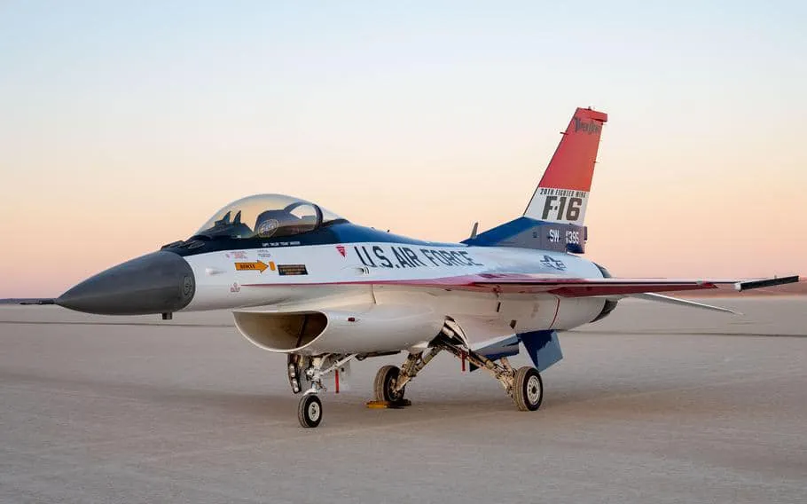

I only managed a meager 74 books in 2023. This was a year, as you can see by me writing this… 8 months late? Yikes.

*USAF Demo Team F-16 in retro camouflage for the 50th anniversary*

## Book of the Year
[*We Are Not One: A History of America’s Fight Over Israel*](/book/we-are-not-one-a-history-of-americas-fight-over-israel-alterman) by Eric Alterman is a damning overview of the debate about Israel in the contemporary American Jewish community. The basic shape of the debate is that there isn’t one. American Jews are expected to shut up, get in line, and back Israel up even as the Israeli government becomes less liberal, more violent, and carries out a horrific genocidal war with American weapons. The average American Jew is actually less supportive of Israeli policy than the average American, but thanks to a clever public relations campaign in the 1960s, and the capture of institutional Judaism by a handful of extreme right wing donors, you’d never know it. As Jewish leaders see younger Jews (myself included) drifting away from the faith and marrying outside the religion, which is reasonably caused by the fact that aside from Zionism and Holocaust remembrance, there’s barely any there there in Reform Judaism, their reaction has been to triple down on the Zionist card.

I read this book well before 10/7 and the Gaza War, and everything that Alterman argues has been proven by the course of events. American Judaism will never be anything more than a crippled adjunct as long as it allows itself to be defined by Israel.

## Best History
[*The Fires: How a Computer Formula, Big Ideas, and the Best of Intentions Burned Down New York City-and Determined the Future of 
Cities*](/book/the-fires-how-a-computer-formula-big-ideas-and-the-best-of-intentions-burned-down-new-york-city-and-determined-the-future-of-cities-flood) by Joe Flood. Stop me if you’ve heard this story before. In 1960s America, an idealistic reform politician, a young operational technocrat, and the RAND corporation decide to manage a complex social issue via sophisticated data-driven models. For all their vaunted scientific objectivity, the effort collapses into a destructive quagmire that devastates an entire region, kills a whole bunch of non-white people, and wrecks the reputations of everyone involved.

No it’s not the Vietnam War, JFK, Robert McNamara, and RAND. It’s the South Bronx, Mayor John Lindsay, Fire Chief John O’Hagan, and RAND, and a microcosm of everything that the post-war technocratic liberal order did wrong. O’Hagan, seeking managerial efficiencies and focused on the technological challenges of fighting fires in new Manhattan skyscrapers, used response time as the main metric of management, completely ignoring the complexities of fighting fires in old densely packed apartment builds riven with undocumented architectural changes. Urban blight spread from burnt out tenemants, with each fire causing a chain of social dislocations and the standing ruins become home to junkies and criminals. Whole neighborhoods in Brooklyn and the Bronx were literally redeveloped into ashes, in a horrific cycle of urban decay that teaches a valuable ecological lesson about the life of cities.

## Best Military History
[*Learning War: The Evolution of Fighting Doctrine in the U.S. Navy, 1898-1945*](/book/learning-war-the-evolution-of-fighting-doctrine-in-the-us-navy-1898-1945-studies-in-naval-history-and-sea-power-hone) by Trent Hone is the story of how the US Navy went from a middling power to a globe-striding colossus. Money and industrial might is the easy answer, but the actual hard part was a leadership culture focused on adaptation and excellence. Through the decades, Navy officers focused on accurate gunfire, undergoing a cultural ship for age of sail seamanship to the new era of steam and mechanically controlled gun laying. This continued through the experiments with naval aviation in the 1920s, and finally culminated in the development of the Combat Information Center in 1942, where the hard lessons of the battles around Guadalcanal were transformed into fleet best practices. Learning War is a fascinating study in both innovation and leadership.

## Best Non-Fiction
[*Of Boys and Men: Why the Modern Male Is Struggling, Why It Matters, and What to Do About 
It*](/book/of-boys-and-men-why-the-modern-male-is-struggling-why-it-matters-and-what-to-do-about-it-reeves), and What to Do About It by Richard Reeves. The guys are not alright. Men die sooner, are more likely to commit crimes and be imprisoned, and adapt less successfully to changing economic and social circumstances. In fact, by the numbers, the disparity in outcomes between the sexes for a boy born today is about as bad as it was for a girl born in the 1960s, when elite colleges were still male only and a woman needed her husband’s permission to open a bank account. Reeves makes several policy proposals, from mild to radical: Men should be a focused group of social statistical study, similar to how women currently are. There should be pipelines encouraging men to enter HEAL (Health, Education, Administration, and Literacy) careers similar to successful efforts to get women into STEM. The roles of fathers should be strengthened, with mandatory paid parental leave and greater rights and obligations towards their children. And finally, it may be wise to delay the entry of boys into school by a year to account for girls quicker emotional and intellectual development.

## Best Science Fiction
[*Spin Control*](/book/spin-control-moriarty) by Chris Moriarty is my favorite of the Spin trilogy. Arkady is a defector from the Syndicates, the genetically altered posthuman society that is colonizing the edges of the galaxy. The Syndicates fight against the “baseline” humans of the UN, arrogantly ruling from orbital habitats around a wounded Earth. Arkady is carrying a precious secret, and he and the operatives from the prior book have to unravel a John le Carré espionage plot set in the never-ending war between Israel and Palestine. Where this book excels is in a Darwinian perspective that life is fragile and the universe dark and dangerous. Only the ability to evolve, to know when to escape the trap of a local maxima of ‘fitness for now’, guarantees long-term survival. The Syndicates, clades of clones grown in vats and carefully culled to fit normative standards, have a human society that draws its inspiration from collective hive insects. Yet even they do not have the ability to stabilize the weakly networked ecosystems of deep space.

## Best Fantasy
[*Piranesi*](/book/piranesi-clarke) by Susanna Clarke is a marvel. Our narrator lives in a Great House, an infinite labyrinth of cyclopean rooms and corridors, massive marble statues, lower chambers flooded with tides, airy upper chambers full of clouds and mist. The House provides for him with fish and seaweed and fresh water, and he records its events and wonders dutifully in his journal. The mystery of the House, and the unfolding revelation of its rules and how the narrator came to be there, is one of the finest gems of writing I’ve had the pleasure of reading in a while.

## Best RPG
[*Defiant*](/rpg/defiant-role-playing-game-kuczynska-marcin-kuczynski) wins by default, because I didn’t do much RPG reading this year (though I did play more than in ages!). But even as default, it’s a great and provocative game. It’s the purest kind of power fantasy, placing your characters as the ruling nobles of secret supernatural houses. You are rebelling against the apocalypse, living life to the fullest to keep the wards up, which means that the entire game is about passion, parties, rivalries, sex, intrigue, and all the best kinds of excess. The rules are tailored to support this story, with your character coming with a consort and court, and an escalating series of scenes about this week’s problem. I’ve never been a World of Darkness guy, but my sense is this is Vampire as it’s actually played, an emotional power fantasy of gleeful transgression rather than a grim and somber wake for the undead.