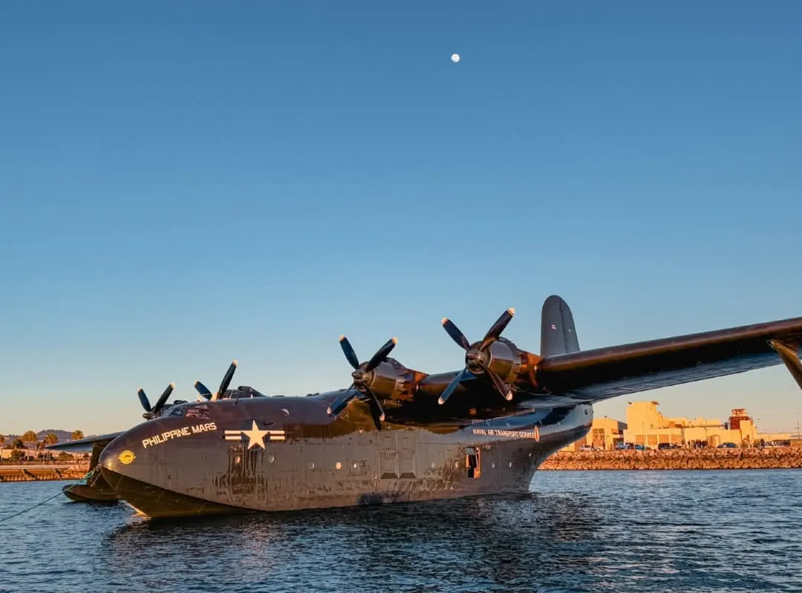

Not going to lie, internet fam. I had about as bad of a year as a person can have and remain standing. But I read some damn good books. These are my favorites.

*The Philippine Mars docked at Alameda on its last flight*

## Book of the Year
[The Unaccountability Machine](/book/the-unaccountability-machine-why-big-systems-make-terrible-decisions-and-how-the-world-lost-its-mind-davies/) by Dan Davies.

Like a lot of you, these days I wake in the morning and I step outside, and I take a deep breath, and scream at the top of my lungs "ARGH AHHH FUCK FUCK FUCK WHAT THE FUCK!!!" Looking back at the first quarter of the 21st century, this has been a deeply stupid and cruel era. I'm not going to give into doomerism, but efforts to advance human rights, protect the climate, and secure peace and understanding were ineffective and sclerotic against some of the cringiest barbarians humanity has produced. So what happened?

*The Unaccountability Machine* places the forgotten theory of Stafford Beard's management cybernetics against Milton Friedman's neoliberal doctrine that the primary duty of the firm is to maximize shareholder value. Management cybernetics is either hoary or charming (I lean towards charming), with a fundamental point that governance of a complex system requires lots of information about the system. The period immediately after WW2 was a triumphant time of managerial experts, people who used data and experience to make decisions balancing many factors against each other. Unfortunately for us, for a variety of cultural and political reasons, the managerial class lost comprehensively to the capitalist class, which doesn't make decisions so much as make bets, and who have the political power to privatize their winnings and socialize their losses.

No one wants to be held accountable. If I had power, I'd use it to shift the accountability onto someone else. But this only works as long as people can be distracted. Follow the money. Follow it all the way up. And balance the books.

## Best Military History
[Under the Red Sea Sun](/book/under-the-red-sea-sun-ellsberg/) by Edward Ellsberg

In 1942, US Navy salvage officer Edward Ellsberg was recalled to duty with a vital mission. The Eritrean port of Massawa was the only potential maintenance facility between Alexandria, which was under imminent threat from Rommel, and Durban, 10,000 miles from the front in South Africa. Britain's naval war in the Mediterranean would fail for lack of ships if Massawa were not active. But before the Italians surrendered the port, they had comprehensively sabotaged everything: blockships in the harbor, the floating drydocks and cranes sunk with multiple naval mines, and the entire machine shop smashed.

Worse, while victory needed Massawa, neither the British nor the Americans had anything to spare for Ellsberg, aside from what he could scrape up stateside before a long journey to the armpit of Africa. Starting from almost nothing, Ellsberg and a handful of helpers assembled basic machine tools from the fragments of the workshop, using those to manufacture better machine tools, and using all of his decades of salvage experience to get the drydocks refloated and blockships moved. He forged a handful of American civilians, Italian POWs, and the scraps of the British Empire into a crack salvage team, fighting against an impossibly bad climate and even more insane bureaucratic SNAFUs.

I read four of Ellsberg's books this past year. They're all worthwhile, and *Under the Red Sea Sun* is a standout.

## Best Non-Fiction
[Silent Knights: Blowing the Whistle on Military Accidents and Their Cover-Ups](/book/silent-knights-blowing-the-whistle-on-military-accidents-and-their-cover-ups-diehl-john-j-nance/) by Alan E. Diehl and John J. Nance

What would you do if you learned that some organization was responsible for the deaths of over 700 American servicemen and women annually? If this were a foreign nation or terrorist group, they'd be introduced to the business end of a carrier strike group. Ironically, this murderous organization is based in Arlington, Virginia, and it's the military's own lackluster safety culture and refusal to learn.

Alan Diehl is an air crash investigator turned whistleblower. His argument for best practices is based on a separation of responsibilities between the "Do" of manufacturers and airlines, the "Regulate" of the FAA, and the "Investigate" of the NTSB. Notably, NTSB investigators are experts insulated from the other parties, and so have the skills and political remit to explain the cause of the accident, and other parties are responsible for making sure it doesn't happen again. By contrast, military accident investigations are carried out by mid-ranking officers who are amateurs accountable to their chain of command and pressured to be team players. A military investigation is inherently a coverup, more concerned with protecting the reputation of the service and finding a scapegoat, than finding the truth and preventing future accidents.

With 2025 opening with a fatal plane crash (provisionally) caused by a military training flight operating in a way that was known to be unsafe, Diehl's book is specifically important, offers a useful general model for governing complex systems, and is a thrilling personal tale.

## Best Science Fiction
[Exordia](/book/exordia-dickinson/) by Seth Dickinson

Anna has just been fired from her pointless office job when she sees an alien who's eating the turtles in Central Park. The alien, Ssrin, drops a bunch of truth bombs. Aliens exist, souls are real, morality is objective, and the universe bends to narrative laws as much as physics. As for Anna, she and Ssrin have a special destiny that together they might defeat the evil alien empire that rules the galaxy.

This might sound like a cuddly or kind book, and that assessment would be entirely wrong. *Exordia* is kin to [Blindsight](/book/blindsight-watts/). First contact happens, Earth's governments react with exactly as much foresight as you'd expect, and everything hinges on a lethal ancient spaceship in a remote Kurdish valley. *Exordia* is an intense thriller about ruthlessly paring away choice and causality, about what it really means to do the right thing in the face of an outside context event and a history of trauma. I read *Exordia* in one convulsive 24 hour gulp, pausing only to take a walk in the sun.

Seth, are you okay? Because I'm not sure I am.

## Best Fantasy
[The Blacktongue Thief](/book/the-blacktongue-thief-buehlman/) by Christopher Buehlman

*The Blacktongue Thief* takes standard fantasy tropes and handles them with imaginative dark humor. Kinch is a professional thief, working off a hefty debt to the Thieves Guild that trained him. An ambush goes terribly wrong, and Kinch is dragged into a Quest, teaming up with a knight and an sorceresses' apprentice to cross a continent and rescue a queen from a city conquered by giants.

The setting takes Europe-with-the-serial-numbers-filed off and makes it thoroughly alien. A series of wars with goblins has devastated every human nation. The first war, the Knight's War, ended with goblin biological warfare rendering horses extinct. The second war, the Thresher's War, had every able-bodied man fight as infantry. The third war, the Daughter's War, saw women drafted en-mass. There's been a lot of damage, and the Taker's Guild has slid into the gaps in this creaking and collapsing society, binding up what remains in ties of criminal debt.

Above all else, this is a novel that delights in its storyteller. Kinch narrates the book in first person, and he is fantastically funny, keenly observant and with realistic blindspots, and just one hell of a raconteur.

## Other Books
I didn't read a history book that gripped me this year, but there was a lot of quality non-fiction. [Flying Blind](/book/flying-blind-the-737-max-tragedy-and-the-fall-of-boeing-robison/) follows the themes of the first two books, looking at how Boeing's engineering culture was hollowed out by stock-price chasing businessmen, killing over 300 people and fatally wounding a major American company. The only reason airlines are buying Boeings right now is Airbus literally can't build planes fast enough. [Going Infinite](/book/going-infinite-the-rise-and-fall-of-a-new-tycoon-lewis/) is the story of Sam Bankman-Fried and the insanely dumb rise and fall of FTX. The memecoin rugpull is the basic pattern of 21st century investments, and SBF was just ahead of the curve. The Secret Life of Groceries is a classic muckraking look at the the food system and the corruption and exploitation that defines it. [A City on Mars](/book/a-city-on-mars-can-we-settle-space-should-we-settle-space-and-have-we-really-thought-this-through-weinersmith-zach-weinersmith/) takes a close look at what it'd actually take to have enough people in space to be more than a scientific outpost, and humanity is nowhere to even close.

Likewise, I didn't do much reading in RPGs last year, though I managed to run and conclude a year-long homebrew cyberpunk campaign based mostly on [Neon Black](/rpg/neon-black-elliot/), which is a triumph.
