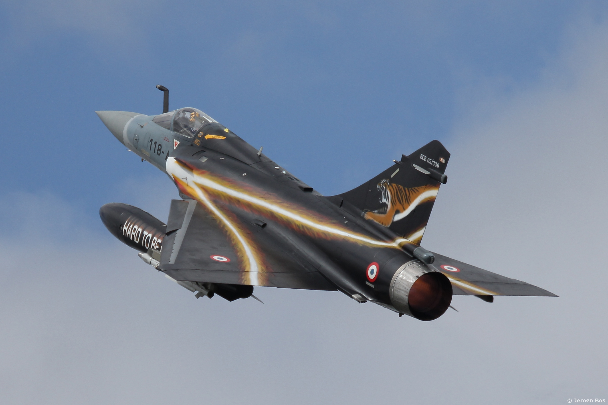

Well, 2025 was better than 2024, but still sucked enough that here I am with books of the year almost six months late. That said, I have an exciting new venue for my reviews, and 2026 is looking up!

*Mirage 2000 at NATO Tiger Meet 2014. Photo by [Jeroenbros](https://www.flickr.com/photos/jeroenbos/14830584309)*

## Book of the Year
[*The Fort Bragg Cartel: Drug Trafficking and Murder in the Special Forces*](/book/the-fort-bragg-cartel-drug-trafficking-and-murder-in-the-special-forces-harp) by Seth Harp.

One of the iconic images of the Global War on Terror is The Operator, a fierce, burly, bearded warrior who combines primitive savagery with high tech weapons and training. As it turns out, if you give young men incredible amounts of firepower, a mission to kill as many "terrorists" as possible, and essentially no oversight while lauding them as heroes, they become a mafia.  Harp uses  the murders of First Sergeant Mark Leshikar and Master Sergeant William Lavinge as an entry point into explaining how Delta Force is really an international drug ring and profoundly racist hit squad that has placed itself outside of all laws. 

Harp makes a strong case that Joint Special Operations Command is a fundamentally rogue organization and has to be burnt to the ground.

## Best Military History
[*Thunder Below!: The USS Barb Revolutionizes Submarine Warfare in World War II*](/audiobook/thunder-below-fluckey-snow) by Eugene B.Fluckey.

There is exactly one submarine in the world that can paint a train on its battle flag, and that's the *USS Barb*. Fluckey recounts his five patrols in the *Barb*, which earned him four Navy Crosses and a Medal of Honor through aggressiveness, skill, and a lot of luck. This is thrilling adventure about submarine combat, told by one its foremost practitioners with a lot of verve.  Torpedoes away!

(and yeah, I recognize the irony of being very negative about JSOC and very positive about WW2 in the same post. Something about the [duality of man.](https://www.youtube.com/watch?v=KMEViYvojtY))

## Best Non-Fiction
[*The Rent Collectors: Exploitation, Murder, and Redemption in Immigrant LA*](/book/the-rent-collectors-exploitation-murder-and-redemption-in-immigrant-la-katz) by Jesse Katz.

*The Rent Collectors* elevates the mundane little tragedies of life on the undocumented margins of Los Angeles into something grand and operatic.  MacArthur Park is a tough neighborhood, with a lot of crime and a lot of illegal immigrants. Giovanni Macedo, a junior gangster, botched a hit against a street vendor who refused to pay his taxes and killed a baby. Wanted by both his former comrades and the FBI, somehow Giovanni evaded capture, turned himself in, and did his best to reform.

With immigrants being the target of an actual war these days, this book reminds us of the humanity of even the worst of the people involved, and how the civil penalties and racist indignities around undocumented labor create the conditions for serious crime.

## Best Science Fiction
[*City of Illusions*](/book/city-of-illusions-guin) by Ursula K. LeGuin.

I've been working my way though the Hainish Cycle, and *City of Illusions* is where LeGuin comes into her own as an author, writing a simply gorgeous Taoist and Jungian journey across both the conquered planet of Terra, and the soul of an ambassador from a distant world who has lost his memory, but may carry the liberation of mankind within himself.

## Best Fantasy
[*The Works of Vermin*](/book/the-works-of-vermin-ennes) by Hiron Ennes.

Welcome to Tiliard, a city built into the stump of a world tree rising from a toxic river. The main mode of inhabitation is infestation, from the 398 known vermin in the Borisch and Sons Exterminator’s Manual, to the unlisted types such as opera-obsessed politicians, bishops with perverse appetites, mutated artists, gentlemen-duelists, dancers with a sideline in revolution (or is it the other way around), and the innumerable laborers who keep it running, and police spies who maintain the official aesthetic primacy of Revivalism.

The plot follows two characters: Guy is an exterminator who will do anything to keep his younger sister Tyro out of the debt which has consumed him. Aster is a perfumer contracted to the chief general of the city who falls in with a mysterious gentleman from the countryside. The stories ramify, mutate, and intersect. This book draws comparisons to *Perdido Street Station*, but Ennes is entirely their own writer and a talent to watch. Both the setting and use of language are truly exceptional.

Fantasy was a *stacked* category this year. I also read the first of Robert Jackson Bennett's Ana and Din mysteries and Tchaikovsky's Tyrant Philosopher series, both of which are widely beloved. [*House of the Rain King*](/book/house-of-the-rain-king-greatwich) and [*By Blood, by Salt*](/book/by-blood-by-salt-odom) are great debuts. And Graydon Saunder's [*Commonweal series*](/book/the-march-north-saunders) is for a very specific type of person ([I'm that type of person](https://www.instagram.com/reels/DYXTiDbhVha/)). All of these are good, even great books, and Ennes topped them all.

## Best History
[*Traitor to His Class: The Privileged Life and Radical Presidency of Franklin Delano
Roosevelt*](/book/traitor-to-his-class-the-privileged-life-and-radical-presidency-of-franklin-delano-roosevelt-brands) by H.W. Brands.

Despite consider FDR my #1 President, I actually know very little about him. Brand's comprehensive biography corrects that gap. Roosevelt had incredible good fortune in his life (polio aside), and rose from a cossetted childhood through the ranks of Democratic politics to the first election in decades that even a ham sandwich running as a Democrat could win. Once in the highest office, he showed keen leadership during the crises of the Great Depression and WW2.

There he demonstrated an active hand at policymaking and strategic wisdom which shaped the 20th century. The New Deal saved America, and America played a key role in WW2 (honesty compels me to admit it was a lot of Soviet blood that won the day, but the US and British contributions were necessary). What is clear is that political leadership takes foresight, insight, courage, and the ability to work the press, the people and especially your subordinates.

## RPG
[*Blades in the Dark - Deep Cuts*](/rpg/blades-in-the-dark-deep-cuts-harper) by John Harper.

*Blades in the Dark* is probably my favorite RPG game of all time. And for all that, I’ve never actually run it correctly, always preferring to eyeball downtime rather than follow the flowchart properly. *Deep Cuts* is something between an expansion and a second edition, and I think a lot of the changes are worthwhile.

Harm is reworked to be less punishing, only penalizing rolls when invoked and then it gives XP. The Threat system drops action rolls for automatic success, which helps the GM with pacing and consequences as the heart of the system.

I'm less keen on the metaplot additions of visitors from an undefined alternate reality; there's plenty of weirdness in Duskvol already.  The upcoming *Blades 68* will give me all the cool new setting details I could want.