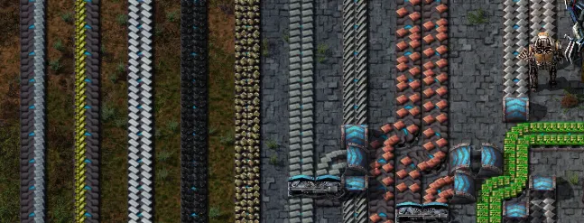
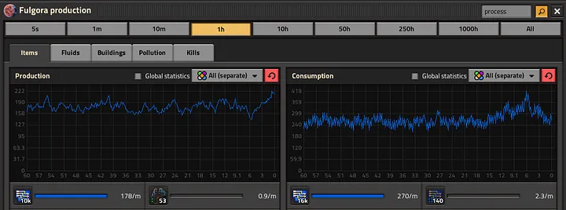
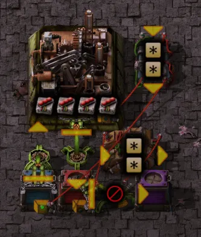

Having used my last week of absolute freedom to finish Aquilo and reach the edge of the solar system, I have some more thoughts about what lessons Factorio: Space Age teaches.

## Flow
Factorio is about flow, first and foremost, the flow of raw resources into science, logistics, and military. Flow teaches concretely the application of Liebig's Law of the Minimum, that growth is limited by the factor present in the least amount.

*A bus of belts, each carrying a different intermediate*

Early in the game, when you're using a bus-patterned factory, where belts carrying intermediate materials like plates head up, and are split off to assemblers on the side, that flow is very visible. And it's particularly annoying when the flow is being directed somewhere irrelevant, say to belt production rather than science, or science rather than that nuclear reactor.

Monitoring flows is one reason why I prefer belts to bots. When a belt based factory is running slowly, it's easy to trace back to the problem. Bots are a little harder to inspect. I guess you can always throw down more factories, but particularly for things which you're producing millions of, this just feels inelegant.

## Stock
While one part of the factory is sputtering because of a low ingredient, the rest can be running well. Excess output builds up, first in the assemblers, then the belts, and finally in chests. Stocks are a mixed blessing in Factorio. While they can tide over moments of slack, unbalanced flows won't rebalance until a stock fills up.

*A 100 process per minute deficit is worrying, but I have over 50000 in storage*

A 100 process per minute deficit is worrying, but I have over 50000 in storage. That means 8 hours to find a way to double my scrap.

Research beaker stockpiles are of course very useful, assuming they're not impacting logistic flows. One new resource I found I had to stockpile was rocket launch ingredients. Mostly, my launches are fairly consistent, about one per planet per minute as my freighters arrive to pick up unique science and building. Except building a new space ship takes about 40 launches as fast as I can do them, which blew out my rocket fuel stocks on both Vulcanus and Fulgora.

## Lock
Locks are the new design challenge in Space Age. Of course, the base game had various ways to crash your base, mostly involving biters eating critical infrastructure or a brownout cascade where you're not generating enough power to fuel your boilers, causing your electrical production to drop, causing your inserters to slow down feeding coal to the furnaces, and on down to crash.

A lock is caused by two or more processes using the same piece of infrastructure at the same time, and one of those processes not letting go. Trains could classically lock if signals weren't set up properly (regular signal: it is okay for a train to wait here indefinitely, chain signal: GET OUT OF THE INTERSECTION ASSHOLE!). Space Age has a lot more processes with two or more outputs, and if one of those outputs backs up, it'll also halt the other processes.

I've hit this on Fulgora, where my solution was using grabbers to pull resources I needed off the main belt to the logistics network, and the rest goes into an infinite whirlpool until it's recycled down to nothing. On Gleba, everything that takes nutrients has a way to pull spoilage out. Space platforms dump excess material over the side. Aquilo makes more ice than it consumes.

All of these problems require solutions with varying degrees of reliability and elegance. The simplest is to throw everything in a sink once it's passed the production blocks, but this is wasteful. Circuit conditions can be used to break locks by opening sinks when needed, though this takes a little more work.

One lock which shows up everywhere, if you choose to engage with it, is the quality system. Quality objects are different, and since they come out of the same assembler via the same grabber, anything using quality modules is prone to locking.

*A parameterized little factory that won't lock as long as there's storage somewhere*

I'm proud of this solution, which is a parameterized little factory. Recipe goes from the assembler to the arithmetic combinator, which multiplies everything by 5 and sends it to set requests. The red output chest is wired to a decider combinator, and anything over 50 gets sent to the active supplier chest, which dumps it to the logistic network. As long as there's storage somewhere, this will never lock and slowly build up a stockpile of whatever it is you need, in the required quality. You could replace the purple chest with a recycler and have more factories making higher quality versions, but rare+ rolls are so infrequent that factories set to those qualities will spend a lot of time idle.

## Are We Done?
You can play Factorio as long as you like. I haven't reached the shattered planet, done any Promethium research, or used spidertrons and fusion reactors. My Nauvis base is a tangle and nowhere near scalable, and the same goes for Aquilo. There's that lurking Fulgora processor shortage in about 8 hours. And my equipment is merely rare, rather than epic. But this might be a good place to pause and find some other way to spend my time.
