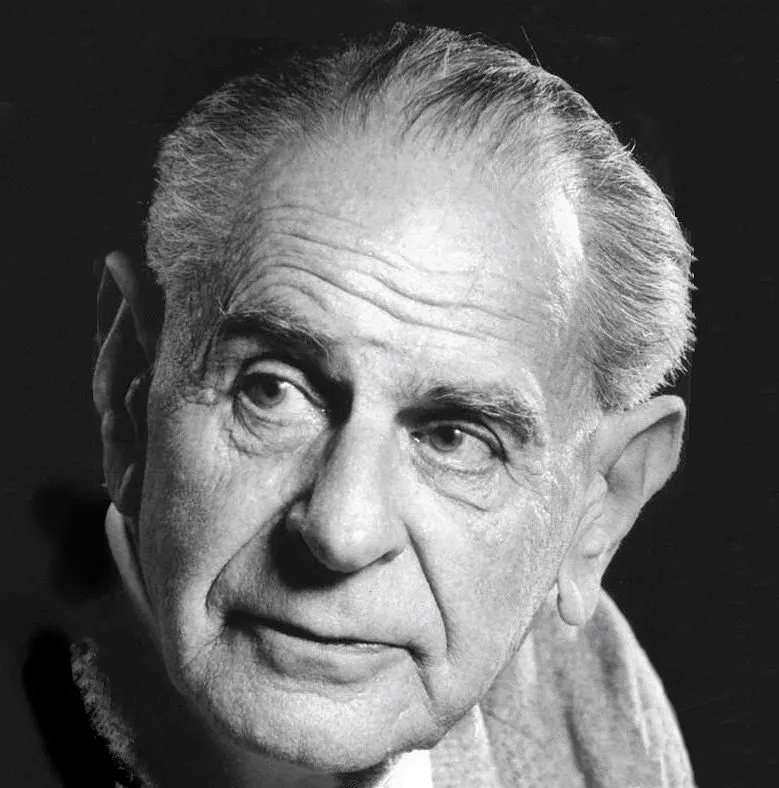
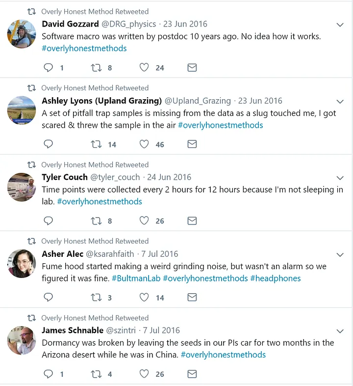
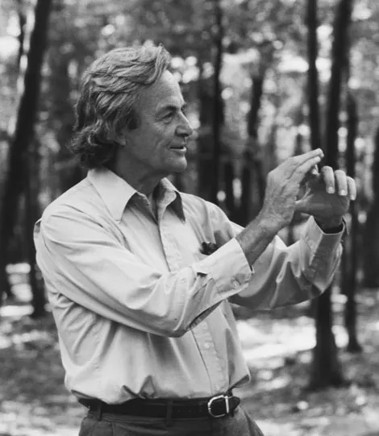
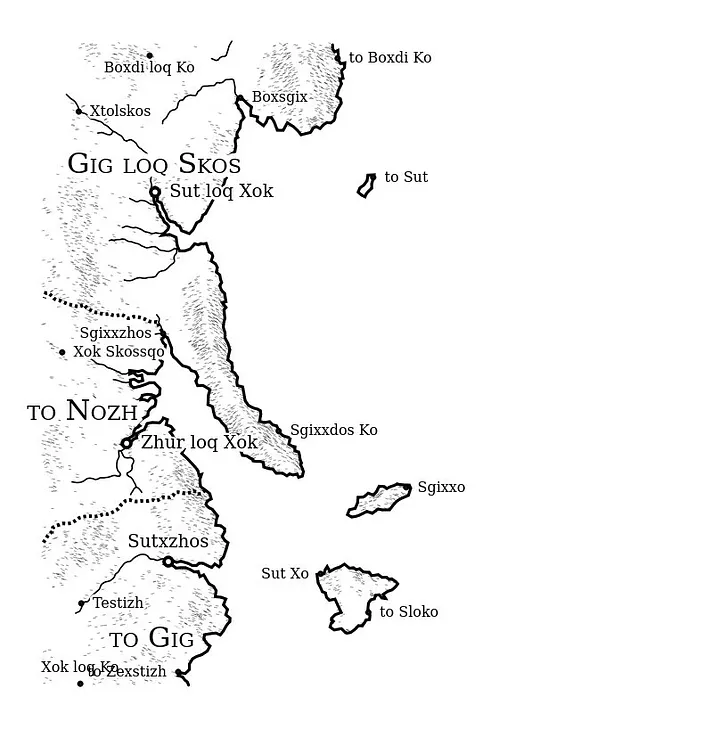

Before I became a data scientist, I was a philosopher of science.* Letters after my name, peer-reviewed publications, conference talks, arguments about Theory and Truth with capital Ts, funny hats, the whole nine yards. As I've learned about data science, I've thought carefully about how the intellectual approaches I was learning fit into what I knew about science and how it works.

Ordinary definitions of science center around experiments, observations, coherent bodies of facts about the natural universe. These ordinary definitions are slippery, tending to conflate the products of science (facts and theories) with the process of science (experiments and observations) and some kind of broader scientific mindset; being disciplined, skeptical, mathematical, and so on.

There are many places to start with philosophy of science, perhaps with empiricism or logical positivism, but I'm going to skip that and go right to the late 1930s, with Karl Popper.

*Karl Popper, Wikimedia Images*

> "Good tests kill flawed theories; we remain alive to guess again."
> — Karl Popper

For Popper, science as a way of knowing was distinguished from other ways by the falsification criteria. Science is *that which has not been disproven yet*, despite our best efforts. Scientific facts are statements about how the world works which have been subjected to every imaginable test, and have held true.

Popper's falsifiability criterion is an important demarcation, especially between science and pseudoscience, but I find purely logical definitions to be lacking in thickness. Science is an activity performed by human beings, and humans are rarely entirely logically consistent. As #overlyhonestmethods shows, people do science while making arbitrary choices about how they perform experiments. Practice is not theory.

*A few ways science actually works*

My own personal definition of science as it is actually done, based on over a decade as a student and practitioner in this field, is that science is about:

1. Purifying phenomena
2. Making representations
3. And public verification

There's a fair amount of jargon here, so to unpack this: When I say purifying phenomena, I refer to labwork, and all the necessary care that is required to set up a laboratory and run experiments. Laboratories are special places, designed such that the phenomena under examination are the only things present. Every other possible factor has been removed and controlled for. (And yes, in a technical sense phenomenon means sensory impression, but I don't have a better everyday word for "specific things that are happening").

I use laboratory broadly here. Some labs are obvious, buildings full of specialized equipment. In some cases, particularly modern physics, the lab is an entire complex of specialized buildings. Labs don't have to be physical infrastructure. Careful studies of nature across time and space can be lab-like, with nothing more high tech than a notebook. Think of the difference between cetology, and going to the ocean to look at whales.

The lab is not the real world, and that is precisely the point. But because what has been done in the lab has been *purified*, it is now able to stand in for the same thing in the real world. It makes a *representation*. When a scientist says "This substance caused all my rats to develop alarming tumors, so don't dump it in the creek by the elementary school," we understand the rhetorical move here. Science, and by extension all that relies on science, works because it renders complex and indeterminate phenomena tractable to human understanding.

The last bit, about public verification, seems rather ordinary to people in the 20th and 21st centuries, but it was incredibly radical in the 18th. The dominant epistemologies of the Middle Ages and Renaissance had been centered around authority, the supreme knowledge of an omniscient creator filtered down through prophets and sages, or deliberately sealed away in a hermetic tradition of hidden knowledge. Science has no central authority. The basis of scientific truth is consensus through experimental replication and peer-review. It doesn't matter how esteemed a scientist is, if an experiment disproves their theories, the theory is wrong (the replication crisis in contemporary science, and problems with peer review will be left for another day). If you're interested in this, I recommend starting with Collins and Pinch's *The Golem: What You Should Know About Science*, and moving on through Shapin and Schaffer's *Leviathan and the Air-Pump*, and closing out with Latour's *Science in Action*.

What of data science? There are certainly parallels between a clean and tidy dataset, and the purified phenomenon of the laboratory. Likewise, a model is a kind of representation. But all scientists work with data, and the cutting-edge of data science, the artificial neural networks and the terabyte+ big datasets, are distinct from science as it has been done since Newton. Data science is about optimizing the parameters of an algorithm against some loss function, or about discovering structure in high-dimensional datasets.

Physicist Richard Feynman had an elegant description of the purpose of science.

*Richard Feynman, Wikimedia Images*

> "What do we mean by 'understanding' something? We can imagine that this complicated array of moving things which constitutes 'the world' is something like a great chess game being played by the gods, and we are observers of the game. We do not know what the rules of the game are; all we are allowed to do is to *watch* the playing. Of course, if we watch long enough, we may eventually catch on to a few of the rules."

As a data scientist, I would like to say that my models are performing well, as determined by metrics like root-mean square error, accuracy, and the F1 metric. I would really like it if parts of them were interpretable, if the features in the dataset correlated to something in the external world. But I would not say that I'm ever 'catching on to the rules of the game.' And I'm certainly not making falsifiable claims as Popper demands. At most, a data scientist can be confident of how well their models generalize.

If understanding all the rules is the *telos* of science, the goal on which the endeavor has been premised, data science has a very different purpose. Jorge Luis Borges captured the purpose of data science perfectly, in a story short enough to reproduce in full.

## "On Exactitude in Science"
*Jorge Luis Borges, 1946. Hurley's translation.*

> … In that Empire, the Art of Cartography attained such Perfection that the map of a single Province occupied the entirety of a City, and the map of the Empire, the entirety of a Province. In time, those Unconscionable Maps no longer satisfied, and the Cartographers Guilds struck a Map of the Empire whose size was that of the Empire, and which coincided point for point with it. The following Generations, who were not so fond of the Study of Cartography as their Forebears had been, saw that that vast map was Useless, and not without some Pitilessness was it, that they delivered it up to the Inclemencies of Sun and Winters. In the Deserts of the West, still today, there are Tattered Ruins of that Map, inhabited by Animals and Beggars; in all the Land there is no other Relic of the Disciplines of Geography.
>
> — purportedly from Suárez Miranda, *Travels of Prudent Men*, Book Four, Ch. XLV, Lérida, 1658

*Marches of Great Ugugpás, from unchartedatlas*

Data science is the term with the widest use, but I believe a more precise nomenclature is 'data cartographer'. Understanding the rules is secondary to having access to a record as close to omniscient as possible, and a query that returns the objects and features of interest. Borges' tale contains an ironic caution that the map is not the territory, a useful encapsulation of what data science does well, and when it might lead organizations astray.

Science has proven immensely powerful as an epistemology. Data science provides a powerful complement to traditional scientific approaches. Recursion Pharmaceuticals is using image-based assays to see how human cells in-vitro react to small molecules in a massively scalable way. To paraphrase Andrew Blevins, one of their data scientists who I saw speak, if every small molecule were a grain of sand, the library of compounds a chemist could synthesize would be a Sahara desert; the ones which have been studied for medical properties would fit in two 55-gallon drums. A million years of science as it has been done would barely make a dent in the unsearched possibilities. A better map could guide scientists towards promising compounds and speed up the first steps of drug discovery.

Even if data science is not properly science, we can still aspire to scientific levels of rigor. We may not be falsifiable, but we can be humble in the face of what our models assume. And we can recognize that the database is only an approximation of reality.

---

*Okay, it's an interdisciplinary doctorate program combining philosophical, historical, sociological, and anthropological techniques for understanding the nature of science and technology. But that doesn't roll off the tongue.
